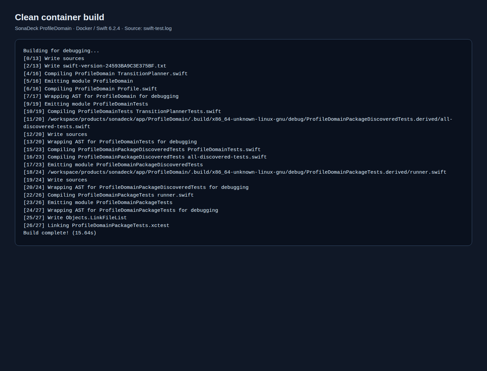
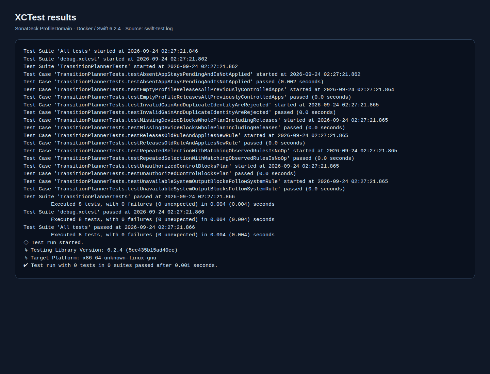

# SonaDeck ProfileDomain Docker 测试汇报

执行日期：2026-09-24。结果：**通过（8 个 XCTest，0 失败；容器退出码 0）**。

## 测试对象与环境

| 项目 | 记录 |
| --- | --- |
| 测试代码 revision | `b6afe2496aa46664d0c75cfc0e1574af36349b1e` |
| 范围 | `products/sonadeck/app/ProfileDomain` 的跨平台配置规则和切换计划 |
| 主机 | Windows，Docker Desktop 的 Linux 容器 |
| Docker | Client / Server 29.8.0；Server OS `linux`，架构 `amd64` |
| Swift | 6.2.4 (`swift-6.2.4-RELEASE`)，目标 `x86_64-unknown-linux-gnu` |
| 镜像 | `swift:6.2.4-noble`；本地 image ID `sha256:9bea530093ffff8cf6c259991715ee843fe4d0f932e612f7f4b79cca6e00db87` |

镜像从 `mirror.gcr.io/library/swift:6.2.4-noble` 拉取并在本地标记为 `swift:6.2.4-noble`；两者的本地 image ID 相同。测试前执行 `swift package clean`，随后在同一容器中执行 `swift test`，完整输出保存为[原始日志](swift-test.log)。复现命令从仓库根目录运行：

```powershell
docker run --rm -v "${PWD}:/workspace" -w /workspace/products/sonadeck/app/ProfileDomain swift:6.2.4-noble bash -lc 'swift package clean && swift test'
```

## 结果

干净构建完成，Swift 输出 `Build complete! (15.64s)`。XCTest 的 `TransitionPlannerTests` 执行 8 项，0 失败；Docker 命令退出码为 0。日志末尾另有 Swift Testing 框架的“0 tests in 0 suites”，它与前面的 8 项 XCTest 属于不同测试运行器，不是遗漏 8 项测试。

| 覆盖点 | 对应用例 | 结果 |
| --- | --- | --- |
| 未运行应用保持待生效 | `testAbsentAppStaysPendingAndIsNotApplied` | 通过 |
| 空配置释放旧应用控制 | `testEmptyProfileReleasesAllPreviouslyControlledApps` | 通过 |
| 非法增益与重复应用身份被拒绝 | `testInvalidGainAndDuplicateIdentityAreRejected` | 通过 |
| 目标设备缺失阻断整套计划 | `testMissingDeviceBlocksWholePlanIncludingReleases` | 通过 |
| 释放旧规则并计划新规则 | `testReleasesOldRuleAndAppliesNewRule` | 通过 |
| 观察值一致时重复选择不产生操作 | `testRepeatedSelectionWithMatchingObservedRulesIsNoOp` | 通过 |
| 缺少音频控制授权时阻断 | `testUnauthorizedControlBlocksPlan` | 通过 |
| 默认输出不可用时阻断跟随系统规则 | `testUnavailableSystemOutputBlocksFollowSystemRule` | 通过 |

## 截图与原始证据

以下图片是用 Chromium 对[原始日志](swift-test.log)的 HTML 展示页截取的**日志截图**；[渲染脚本](render-evidence.py)只把日志分为构建段和测试段并进行 HTML 转义，不修改测试结果。保留 HTML 页面以便核对截图内容。

- [干净构建截图](screenshots/build.png) · [对应 HTML](screenshots/build.html)
- [XCTest 结果截图](screenshots/tests.png) · [对应 HTML](screenshots/tests.html)

原始日志 SHA-256：`1CE3818E5766FBBD0FCB6A407F3A4BB79F574830CEA55F7B3B13B663A42D91CE`。目录内的 `.gitattributes` 禁止 Git 转换该日志的行尾，以便检出后继续核对这一校验值。





## 结论与限制

这次结果仅证明当前 Swift 领域包能在指定 Linux / Swift 容器中编译，并通过上述纯逻辑测试。它没有执行 macOS 构建、Core Audio 进程 tap、权限、实际音量 / 路由、设备热插拔、退出恢复、菜单栏或 UI 动画测试。M0 真机音频可行性门槛仍未通过；后续按[路线图](../../../docs/roadmap.md)在 Mac 上验证。
