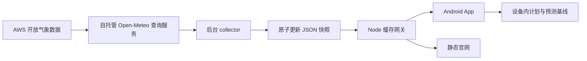

# 开发与运行

更新：2026-09-30。这是首个内部工程增量，不是完整 P0 或公开测试版。范围见[实施计划](implementation.md)，市场和变现判断仍待验证。

## 目录与数据链路



这里只有读取已生成天气输出和规则处理，不做天气模型推理。默认六座城市，无全球地理搜索；网关不接受任意经纬度透传，采集串行、默认每小时一次。`/v1/forecast` 允许公共缓存 60 秒；`/v1/window` 随当前时间变化，明确 `no-store`。Cloudflare 尚未部署，不能仅凭响应头宣称已获边缘缓存。

## 本机快速运行

Node 22+、Docker Desktop。以下 PowerShell 命令均从仓库根目录运行。

完整本地栈：

```powershell
docker compose -f products/weather-app/compose.yaml up -d --build
docker compose -f products/weather-app/compose.yaml logs -f collector
```

官网和网关：`http://127.0.0.1:8787`。首次冷读取可能较慢；在 collector 成功前，相应城市返回 503，不显示演示天气。缓存保存在 `dayward_forecasts` 卷；普通 `down` 不删除卷。镜像会下载天气片段，内存限制不是性能承诺。

```powershell
docker compose -f products/weather-app/compose.yaml down
```

若本机已有 Node 网关占用 8787，应先在其终端结束该任务。不要结束其他项目的服务。当前本地预览可能通过下述 Node 模式启动；两种模式不应同时绑定同一端口。

本地开发模式，先单独启动来源容器：

```powershell
docker run -d --name dayward-dev-source --memory 2g --cpus 2 --tmpfs /app/data:rw,size=536870912,uid=999,gid=999,mode=0700 -e REMOTE_DATA_DIRECTORY=https://openmeteo.s3.amazonaws.com/data/ -e CACHE_SIZE=256MB -p 127.0.0.1:18089:8080 ghcr.io/open-meteo/open-meteo@sha256:e1517a01a061fd96e2a9017d022c5809bb51725bcd733bcbed435e7ea32dd9da
$env:PLACES='london,edinburgh,paris,berlin,new-york,san-francisco'
node products/weather-app/service/worker.mjs
node products/weather-app/service/server.mjs
```

最后一条以前台方式持续运行。第二个终端可执行测试或再次运行 worker。来源端点默认为 `http://127.0.0.1:18089`，可通过 `SOURCE_URL` 指定自己的查询服务；禁止将 Open-Meteo 公共免费域名作为此商业候选实现的默认上游。`DATA_DIR` 可指定缓存目录；默认 `service/data/`，已忽略 Git。常驻 worker 设置 `COLLECT_INTERVAL_SECONDS=3600`；不设置则运行一轮退出，任一地点失败则退出码 1。

## Android 构建与连接

工程：`app/android/`。内部包名 `app.dayward.internal`，版本 `0.1.0-internal`，minSdk 28、compile/targetSdk 36。版本固定为 AGP 8.13.2、Gradle 8.13、Kotlin 2.2.21、Compose BOM 2025.12.00；不是“追最新版本”的承诺。Gradle Wrapper 和分发包均按官方 SHA-256 核验。

本地有 JDK 17+、Android SDK 36 时：

```powershell
cd products/weather-app/app/android
.\gradlew.bat assembleDebug testDebugUnitTest lintDebug
```

没有本地 SDK 可在仓库根目录用此次固定镜像：

```powershell
docker run --rm --name dayward-android-build --memory 5g --cpus 3 -v "${PWD}/products/weather-app/app/android:/workspace" -v dayward-gradle-cache:/root/.gradle -v dayward-android-home:/root/.android -w /workspace ghcr.io/cirruslabs/android-sdk@sha256:f9b3ea9ed2b5fc9522adae82c7b4622ab7aa54207ef532c8e615a347dca08f31 bash gradlew --no-daemon assembleDebug testDebugUnitTest lintDebug
```

成功构建后的 APK 路径：`app/android/app/build/outputs/apk/debug/app-debug.apk`，不纳入 Git，不是商店发布包。

Docker 的 `dayward-android-home` 卷保留本地 Debug 签名，避免每次临时容器重新生成签名而无法覆盖安装；它不是生产签名。不要将这个卷或 keystore 提交到 Git。

- Android 模拟器：Setup 中输入 `http://10.0.2.2:8787`，Connect gateway。
- USB 真机：本地 Android SDK 执行 `adb reverse tcp:8787 tcp:8787`；安装 APK，在 Setup 输入 `http://127.0.0.1:8787`。这条方式无需把开发网关暴露到公网。
- Release 配置禁止明文 HTTP。只有 Debug 允许本地 HTTP；未配置生产地址、签名或正式发布流水线。

试用顺序：连接 → Weather 选择城市 → Load collected forecast → 选择开始时刻、时长、偏好 → Inspect this window → 保存 → Plans 查看保存的预测 → 后台重新采集 → Check against latest collection。缺信息时显示 Reference only，不把手选计划当作推荐。

## 数据与保存语义

- UTC 整数时间戳计算持续时间，界面按地点时区显示并附时区，重复夏令时小时可区分。
- 降水和阵风是前一小时统计，将 API 的 t+1 对齐到 `[t,t+1)`；温度/风是 t 时刻样本，不称连续最高/最低。原生步长未知，不开放自动建议。
- `fetchedAt` 是查询时间，绝不写进 `runAt`；来源周期未知保持 null。抓取超过 6 小时显示 stale，这是内部缓存策略，不代表模型精度。
- 基线保存选择时段的全部小时记录、模型/规则/变换版本和窗口统计。复查不覆盖基线；同一抓取批次不称“预报确认未变”，不同口径不冒充天气变化。
- 最多五个尚未结束的计划；过去计划保留。原子文件写入失败不把内存状态标作保存成功；无法解析的原文件保留且禁止覆盖，供开发者恢复。
- 当前天气不持久缓存在手机，离线仍可看保存计划；刷新失败显示错误。Android 备份关闭，卸载/清除存储会删除计划，无跨设备同步。
- 预警、自动候选窗口、多地点同屏比较、通知、组件、远期趋势、真实广告/购买均未在此增量实现。

## 验证

后端：

```powershell
node --test products/weather-app/service/*.test.mjs
```

领域与接口测试使用明确合成数据；生产/内部运行路径没有模拟天气 fallback。实际执行结果及限制另见[本轮工程验证](implementation-validation-2026-09-30.md)。

官网在 Chrome 检查桌面和窄屏、主按钮锚点、来源/隐私页面和键盘可达性。现有 `prototype/` 是独立的旧交互研究原型，包含模拟天气/广告；不能拿其测试结果证明真实 App。

## 分机部署前仍需完成

当前 Compose 共享卷验证本地架构。NAS → VPS 还需要经过认证的单向发布、内容/版本校验、失败重试与回滚、TLS、访问限制和运维监控。网关没有写入接口，不把卷直接共享到公网。家庭网络、N301 运行成本、长时间可用性、数据许可义务与目标国家预警覆盖仍须验收。

Open-Meteo 查询镜像未修改，源码与许可证见[官方仓库](https://github.com/open-meteo/open-meteo)；此实现不复制其服务代码，数据归属及变换说明在官网与 App 中显示。公开运营前仍需按实际部署形态复核义务。
