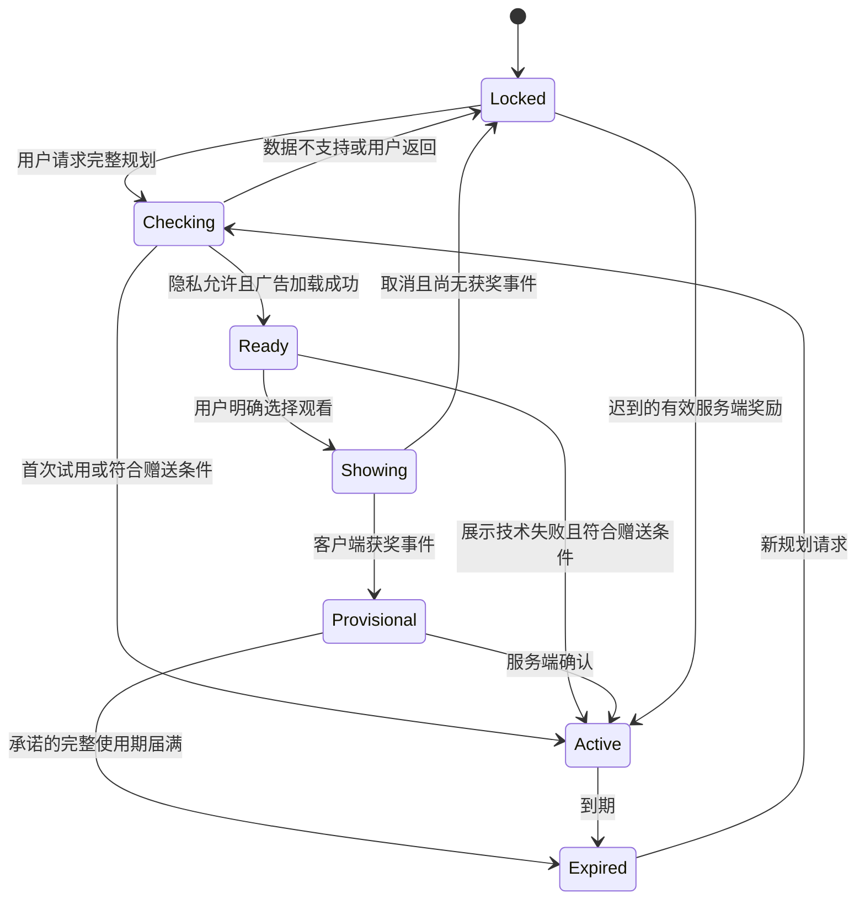

# 广告权益、失败恢复与单位经济

更新日期：2026-09-30。状态：设计提案；参数未经广告实验验证。本文件是奖励时长、次数、发放规则及收益模型的唯一主要定义位置。功能权限见[产品需求](product-spec.md)。

后续状态：用户正在重新评估欧美市场的广告、买断和会员；本文件是保留的广告方案，不代表最终收费决定。先核算[持续成本和免费替代](cost-and-free-alternatives-2026-09-30.md)，不能以未经证明的昂贵模型依赖作为订阅依据，也不能把开放数据直接等同于零运营成本。

## 1. 用户愿意交换什么

用户交换的是一段注意力，得到一次完整规划的方便。广告只由明确的规划意图触发：比较多个地点、自定义活动偏好或打开可用的周趋势。日常天气、一个地点的默认活动窗口、已有计划变化、来源和预警均不以看广告为前提。

首期只有一种奖励“Planning access / 规划权限”，不设置积分、连续签到或多个难理解的等级。不售卖所谓更准确模型；同一数据在免费和解锁状态下质量一致。广告观看本身不是激活指标。

## 2. 权益参数

| 参数 | 规划默认 | 目的与限制 |
| --- | --- | --- |
| 一次奖励 | 24 小时完整规划权限 | 覆盖完整比较任务，包括新计划和刷新；功能仍受实际覆盖限制 |
| 首次试用 | 首次主动进入完整规划时赠送 24 小时 | 先让用户知道价值；不要求看广告、绑卡、开订阅 |
| 生效范围 | 当前安装的所有计划 | 不按地点、变量、图层、单次刷新另要广告 |
| 观看上限 | 已有有效权限时不提供再次观看；任意滚动 24 小时最多一次获奖广告 | 不累计、不囤积时长；意外重复回调幂等 |
| 预加载 | 用户主动打开规划入口后，满足隐私和数据覆盖条件再加载 | 不在冷启动为了“准备广告”阻塞免费天气 |
| 无库存/展示技术失败 | 数据可用且系统无有效权益时，赠送同样 24 小时权限 | 当前安装任意滚动 24 小时最多一次自动赠送；不伪报为观看收益 |
| 隐私状态不允许广告 | 不发广告请求；保留免费天气，采用上述赠送权限规则 | 不以改变同意选择为解锁条件；成本要计入无广告赠送 |
| 用户主动取消 | 没有完成奖励则不新增权益，保留草稿与基础功能 | 已产生获奖事件时即使随后关闭仍算完成 |
| 到期 | 停止新批量比较；已保存静态结果和单地点基本跟踪保留 | 不突然遮住当前正在读的结果；下一次刷新前说明 |
| 换设备/重装 | 无账号首期不保证跨设备恢复 | 在帮助中说明；不以设备指纹或强制登录弥补 |

无库存赠送可能被重复利用，首期接受有限单点内容成本，以服务端会话和速率限制控制批量抓取。不开启侵入式指纹，也不把 API 错误伪装成广告无库存。若赠送比例使成本无法承担，先调整服务范围和奖励设计，不静默取消已承诺权益。

## 3. 展示前合同与覆盖检查

点击“观看广告”前固定一份 `RewardOffer`：奖励项目、可用功能、权益时长、当前安装、到期计算方式、数据覆盖摘要、配置版本和会话编号。用户拒绝后可正常返回。权益由 App 提供，不暗示 Google 为其质量担保。

先确认所请求日期、地点、变量确实有可供展示的数据，再发放试用或申请广告。某项周趋势无覆盖时，它不应出现在该次奖励承诺中；不能让用户为了一个不可用的目标观看广告，即使另有功能可以使用。

用户看到的明确操作是“观看广告解锁规划”，不是“继续”“查看结果”或“支持我们”。不承诺广告具体时长，不要求广告点击/安装/购买/评价，不让模型分歧提示变成恐惧促销。

Google 奖励广告规则要求事先清楚披露奖励、自愿选择、可拒绝且不妨碍正常使用、完成后兑现；奖励需符合其非转让和应用内使用等要求。本方案采用应用内访问权限，并非获得了平台预先批准。[官方奖励政策，2026-09-30 核验](https://support.google.com/admob/answer/7313578?hl=en)

## 4. 奖励状态与恢复



`Provisional` 已允许使用承诺的权限，不能把用户留在“验证中”无限等待。它的期限和正式权益相同；一旦开始，不因普通网络延迟缩短。暂时无法连服务端时使用已缓存结果并记录待恢复收据。

客户端奖励回调与广告关闭回调不是同一个事件，不以关闭广告或客户端计时判定获奖。SDK 和广告源可能有回调顺序差异；开发只使用测试广告。[奖励回调文档](https://developers.google.com/admob/android/rewarded)

服务端验证签名、广告单元、奖励项目、会话绑定和唯一交易；重复回调不延长权益。`custom_data` 只携带随机会话引用，不含目的地或位置。签名验证要遵从原始参数编码，不能先改写查询字符串。[SSV 官方说明](https://developers.google.com/admob/android/ssv?authuser=2)

| 故障 | 必须行为 |
| --- | --- |
| 展示前加载失败/无广告 | 符合规则则赠送；保留草稿，记录独立原因 |
| 观看完成、应用被杀 | 下次通过会话和服务端收据恢复；用户不必再看 |
| 服务端先到、客户端事件丢失 | 服务端奖励可独立激活；首次成功交付时开始可用期 |
| 客户端先到、服务端延迟 | 先发完整临时权限，后台核对；超时不能要求重复观看 |
| 奖励重复、乱序或重放 | 同一会话/交易只产生一次权益，状态单调推进 |
| 完成后所承诺数据无法加载超过 5 分钟 | 权益保留，并记录一次补偿；7 天内首次恢复可交付时至少再给 24 小时，不逐次刷新累加 |
| 服务超过 7 天仍未恢复 | 该会话转为可在恢复后领取的一次补偿，设置中可见；暂停对应奖励入口并公开故障状态 |
| 系统时间回拨或跨时区 | 用服务端签名的到期时间与本地单调时钟；无法核对时保留最近可信状态，不清空结果 |

每次权益包括 `grant_reason`（试用、广告、赠送、补偿）、开始/结束、原始会话和已用补偿标记。实际广告收益只按广告平台确认的收入统计，不能把临时权限数量当成收入。异常或疑似滥用可以限制未来会话，不能因一般回调延迟撤销已经承诺的正常奖励。

## 5. 收入与成本：可审计的假设

设 `D` 为日活，`p` 为当天无有效权益且有完整规划需求的比例，`u` 为其自愿请求广告比例，`f` 为请求后真正产生可计费展示的比例，`e` 为每千展示净收入。所有值都必须按国家、平台和同意状态实测。

```text
日展示 I = D × p × u × f
月广告收入 R = 30 × I × e / 1000
日广告奖励 ≈ I × 完成获奖比例（它不是展示收入的乘数）
月贡献 = R − 数据许可/套餐 − 超额调用 − 服务/缓存/存储
             − 地图/地理编码/带宽 − 其他运营可变成本
经营结果还需扣除人工、固定运营和获客成本。
```

表中均为演示输入，不是市场报价、承诺或预测。假设 D=10,000、日活稳定、无后续无效流量扣款，实际须按结算更正：

| 假设 | p | u | f | e（美元） | 日展示 | 月收入（美元，未扣成本） |
| --- | --- | --- | --- | --- | --- | --- |
| 低 | 15% | 30% | 60% | 3 | 270 | 24.30 |
| 中 | 30% | 50% | 80% | 8 | 1,200 | 288.00 |
| 高 | 50% | 70% | 90% | 15 | 3,150 | 1,417.50 |

中档若完成奖励比例为 85%，日广告奖励为 1,020；请求但未展示的 300 次可能走赠送，试用另计。它们都会产生查询成本，却不能当作成功广告收入。赠送带来的后续 24 小时应从 p 的实测中扣除，不能假定同一个人不断产生新广告。

以中档展示量计算，若月服务总成本假设为 $300，打平所需 e≈$8.33；若为 $1,000，则需 e≈$27.78。还没扣人工与获客。这说明“有广告就能免费提供所有高级天气”不是可接受的商业前提。

成本表必须分开填写：供应商固定商业费、各接口计费权重、按地点/起报时间的真实缓存命中率、已保存计划后台刷新、试用/赠送、地图和地理编码、预警、日志、出口流量。单点数据不能按像素请求来画全球地图。

Open-Meteo 当前说明公共免费 API 为非商业用途；付费服务提供商业许可，长时段/多变量可能增加计费调用数。预算不能把广告 App 当成免费接口项目。[官方价格与许可说明，2026-09-30 核验](https://open-meteo.com/en/pricing)

## 6. 商业验证与不允许的优化

先比较“免费试用后的使用价值”，再测试奖励接受度，最后用小范围真实广告测净收入和赠送成本。原型中的模拟广告不能验证填充率或 eCPM。广告收入高但计划完成和留存下降，仍算失败。

允许测试奖励说明清晰度、入口位置、权益时长的后续版本。禁止在同一已承诺奖励期间改权益、增加观看数量、故意降低免费数据质量或用预警逼迫观看。

如果广告经济性不成立，优先缩小服务地区/高成本功能、提高缓存复用，或重新讨论商业方式。订阅、买断、联盟营销均不属于本轮默认；不能以盈利目标为由自动加入。
