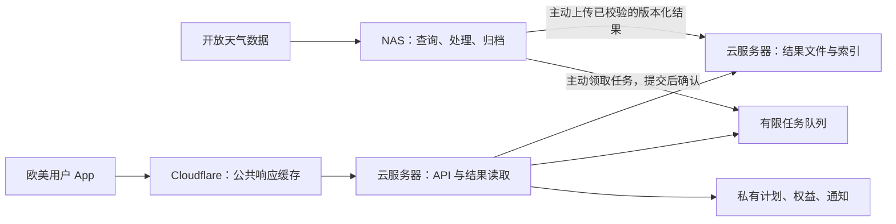

# NAS、云服务器与 Cloudflare 的部署可行性

核验日期：2026-09-30。阶段：架构建议，未连接或配置 NAS、云服务器及 Cloudflare。用户提供配置：CPU 型号记为 N301，32 GB DDR5，三星 990 PRO 2 TB，大陆家宽，上行约“5M”，云服务器未定。CPU 完整型号与指令集尚未实机确认，不擅自替换成 N300/N305；带宽先保守按 5 Mbps 估算，若实际指 5 MB/s，理论吞吐相差 8 倍。下文不把本地 Docker 实验当作 NAS 实测。

## 1. 结论与推荐分工

可行，适合个人开发者的早期天气产品。但推荐让 NAS 负责后台数据生产，让云服务器持有可直接服务的结果。只有转发而没有结果副本的云服务器，不能解除家庭断网和冷查询对用户的影响。

这是结果发布与异步任务，不要求每次用户请求都经过 `Cloudflare → VPS → NAS → 数据源`。家庭公网 IP 不再是服务正常运行的必要条件。云服务器保存当前可用结果；NAS 停机后新数据不能保证更新，但已有结果仍可按真实时效展示。

| 位置 | 适合的任务 | 约束 |
| --- | --- | --- |
| NAS | Open-Meteo 按需查询、活跃地点预取、统一数据格式、周统计核验、历史归档；未来确有必要的小模型后台任务 | CPU/内存/SSD 和更新速度待实测；不训练全球天气模型，不预取所有坐标 |
| 云服务器 | 对外 API、公共结果副本、有限任务队列、权益账本、最小计划记录、通知作业、预警适配 | 应独立回答已发布天气；不把写用户计划、鉴权或预警全放在家庭网络后 |
| Cloudflare | 缓存明确公开的天气结果、静态资源、边缘访问控制 | 不能替 NAS 计算，不能自动把所有 JSON 变成缓存，也不是永久备份 |
| Android 客户端 | 单位换算、偏好阈值筛选、短文本模板、收藏与草稿 | 不用云端算力完成手机即可完成的工作；不把天气数据来源不明的结果称为推荐 |

上一轮实测主要揭示远程冷读成本：三模型短期约 42 秒，EC46 周距平约 5 秒，原样暖查询低于 10 毫秒；不是证明这些功能必须有大 CPU 或 GPU。详见[实验](../experiments/free-sources.md)。数据所在存储与计算位置之间的延迟可能比参数规模更重要。

## 2. 三种拓扑的选择

| 方案 | 优点 | 局限 | 建议 |
| --- | --- | --- | --- |
| Cloudflare → NAS Tunnel | 少一台 VPS，配置路径较短 | 未缓存请求和全部更新依赖家中网络；私有业务同样受影响 | 仅适合小范围演示 / 非关键服务的候选 |
| Cloudflare → VPS 纯反向代理 → NAS | VPS 提供固定入口，可选择家中到 VPS 较好的线路 | NAS 故障仍会拖垮未缓存请求；多一跳不一定更快 | 可联调，避免作为最终唯一查询路径 |
| Cloudflare → VPS 结果副本；NAS 异步发布 | 大部分读取不依赖 NAS 在线；故障与计算高峰不直接传给用户 | 需要版本发布、任务状态和过期管理 | 首选试验架构 |

Cloudflare Tunnel 通过主动向外连接接入，通常不需要开放家庭入站端口，但它不消除家庭带宽与断电影响。[官方说明](https://developers.cloudflare.com/tunnel/)

推荐架构优先用 NAS 主动 HTTPS 领取任务、上传结果；只需应用级凭证、任务幂等和重试。若确需 VPS 主动调用 NAS，使用受限 WireGuard 隧道等私有连接；NAT 环境的 keepalive 按实际网络配置，不暴露 NAS 管理、SMB 或 Docker socket。[WireGuard 文档](https://www.wireguard.com/quickstart/)

服务器选址应比较用户到云入口、NAS 到服务器、取数节点到数据源三段的实际 P95 延迟与丢包。[Open-Meteo 开放数据库](https://github.com/open-meteo/open-data)位于 AWS us-west-2 是选址参考，但不能直接推出所有欧美用户都应经美国西部。NAS 已确认在中国大陆，应额外实测国际下载和结果上传；不把“公网可达”当成跨境链路稳定。5 Mbps 是上行假设，不能据此推断下载上限或到 AWS 的 RTT。

若延续英国研究样本，先试欧洲云区（如德国、荷兰或英国）；若美国用户优先，试美国云区。美国西部值得作为家宽/数据源链路对照，但不保证对所有欧美请求更优。香港/日本等中转只有实测明显改善时再加，首版不建立多台跳板，也不在测试前购买高价大陆优化线路。区域可选性参照[供应商区域目录](https://docs.digitalocean.com/platform/regional-availability/)，不是指定供应商或购买建议。

## 3. 缓存与发布：真正影响成本的部分

Cloudflare 默认不缓存 HTML / JSON。对公开天气 GET 路径明确设置 Cache Rules；鉴权、计划、权益、通知和个人位置记录按私有响应处理。不要设置整个 API 一律缓存，也不要忽略全部查询参数，否则不同地点/条件会拿到同一个结果。[默认行为](https://developers.cloudflare.com/cache/concepts/default-cache-behavior/)、[缓存键](https://developers.cloudflare.com/cache/how-to/cache-keys/)

建议把可共享的天气数据和用户条件分开。公共结果不含安装 ID、家庭地址标签或付费收据；如果某类数据本身受权益控制，就不能用公开 CDN URL 绕过访问控制。

结果键包含数据产品/模型、版本、地点或网格映射、变量集和统计口径；涉及插值、海拔修正时也必须区分。尽量发布标准单位与 UTC 时间序列，客户端做单位显示转换。日统计仍须明确当地日界线，不能简单忽略时区来提高命中率。格点复用不得掩盖山地/海岸差异。

每个快照至少包含 `snapshot_id`、源起报时间（未知则 null）、抓取时间、有效区间、缺失字段及数据质量状态。发布流程：先写完整的新版本并校验，再切换当前版本索引；失败时保留上一份，不能先覆盖旧文件再半途退出。多模型各自记录起报时间，不假设同步更新。

缓存时间和预报有效性是两件事：版本化历史快照可以长缓存，当前版本索引用较短缓存；显示与推荐仍按[预报方法](forecast-method.md)中的新鲜度规则判断。旧索引到达客户端时同样检查数据时间，不能靠 HTTP Age 或新响应时间将旧预报重新变成“最新”。不在本文件另定义一套冲突的新鲜度阈值。

VPS 应保留必要版本，不只依靠 Cloudflare 边缘缓存。边缘缓存未命中或失效时，从 VPS 结果文件读取；这比直接打回 NAS 更稳定。同一源/周期/地点的重复缺失请求合并成一个任务，限制地点数、变量、日期跨度与任务队列长度，防止被当作无限天气计算代理。

新地点未预取时：返回明确的处理中状态并限频查询；若有尚合格的旧数据可以先展示。NAS 离线且没有可用结果时显示暂不可用；可接区域免费来源作为有边界的备选，但更换模型必须标记，不能悄悄沿用旧来源的变化基线。

## 4. 何时引入 R2 或 Workers

最小版本只需 NAS + 一台 VPS + Cloudflare 缓存。VPS 上可采用单应用、结果文件、轻量数据库与同机任务表，不预设 Redis、Kafka、Kubernetes 或 GPU。

结果规模或备份需求增长后，可把公开版本化天气文件放到 R2，经自定义域名和缓存规则分发。R2 不是天气计算平台；公网可读桶不能包含用户计划、位置标签和私有凭证。生产缓存使用自定义域名，`r2.dev` 仅为开发用途。[公开桶文档](https://developers.cloudflare.com/r2/buckets/public-buckets/)

R2 Standard 当前包含每月 10 GB-month 存储、100 万次 Class A 和 1,000 万次 Class B 免费量，外发流量不收费；超量存储与操作仍计费。不能只看到免费出口就假设无限请求免费。Workers 是另外的计算/请求账单，首期可不引入。[R2 定价](https://developers.cloudflare.com/r2/pricing/)、[Workers 定价](https://developers.cloudflare.com/workers/platform/pricing/)

R2 的对象操作强一致，不代表已经缓存的当前版本索引立刻更新；仍使用版本化文件与明确的索引缓存策略。[一致性说明](https://developers.cloudflare.com/r2/reference/consistency/)

## 5. 资源与成本如何估算

32 GB 内存和 2 TB SSD 从容量上足以开始小规模查询/缓存验证，无需先升级硬件。CPU 指令集、镜像支持和 NAS 系统权限仍需实机检查；上一轮是 x86-64/WSL2，不代表该 NAS 已跑通。Open-Meteo 官方仍建议至少 8 GB 内存，详情沿用[成本研究](cost-and-free-alternatives-2026-09-30.md)。

建议初始实验给天气容器 8–12 GB 内存上限、2 个并发任务，热点缓存先控制在约 100 GB 内，保留系统和家庭服务余量；这是限额建议，不是实测最优配置。990 PRO 用于热点随机读写，不把 2 TB 全部灌满全球数据。SSD 健康、持续温度及已有磁盘工作负载也应记录。没有证据需要加 GPU；小语言模型仍不进入首版必需链路。

若 VPS 只做 API、少量私有记录和静态结果读取，推荐先试 2 vCPU、2 GB 内存、约 40 GB SSD；这是待测起点，不是容量保证，也不能用来运行完整自托管 Open-Meteo 再声称符合官方建议。只有常见请求持续等待 NAS 或 NAS 国际取数成为瓶颈时，再评估将热点查询迁往云端。NAS 做公开气象网格任务，用户身份、精确行程和权益记录留在云端/本机，不为气象计算额外传回家中。

按 5 Mbps = 0.625 MB/s 理论上限计算（十进制单位，未扣协议和网络损耗）：

| 一批上传大小 | 理论最短时间 |
| --- | --- |
| 20 MB | 32 秒 |
| 100 MB | 2 分 40 秒 |
| 500 MB | 13 分 20 秒 |

这些值不能当成国际传输实测。如果每个未缓存请求返回 100 KB，10 请求/秒约需 8 Mbps，已经超过家宽上行；因此不能仅靠反向代理承载用户并发。后台发布可先限制上传为 2–3 Mbps，留出家庭网络空间；具体调整取决于链路和更新期限，不固定追求满速。

示例假设：5,000 个去重地点，每地点每日发布 4 份、每份 100 KB，得到约 2 GB/日结果上传、60 GB/月；保留两天全部版本约 4 GB，基础写入约 60 万次/月。这里的 100 KB 是演算输入，不是上一轮实测负载。索引、重试、多个产品、更多字段、旧计划快照和备份另计；上游读取量可能远大于最终 JSON。

计算公式：

- `发布流量 = 去重地点数 × 每日发布次数 × 每份字节数`
- `存储量 = 每日发布量 × 保留天数 + 私有计划引用的保留版本 + 备份`
- `NAS 增量电量(kWh/月) = 增量功率(W) × 24 × 30 / 1000`
- `总经济成本 = VPS/域名/云服务/增量电费 + 维护时间价值`

NAS 原本就全天运行时，应关注新增任务带来的增量功耗；需要因此额外常开时再计算整机功耗。月均上行低不代表高峰发布不会拥塞，按批次设并发、重试退避和上传带宽上限。

## 6. 故障与验收

| 场景 | 预期行为 |
| --- | --- |
| NAS 断网 / 重启 | 云端已有结果仍可读；新鲜度变差明确显示，超限退出推荐；未知地点不得假装有结果 |
| 发布一半中断 | 当前索引继续指向已完整校验的版本；恢复后幂等续传 / 重做 |
| 多用户请求同一未生成地点 | 合并任务；有界排队，不重复大量取数 |
| 公共缓存失效 | VPS 从自己存储读取；不强制回 NAS |
| 隐私或权益 API 请求 | 不进入公共缓存；不同用户不能读取彼此计划 |
| 官方预警源故障 | 独立展示不可用状态；不拿旧列表或空列表声称没有预警 |

验证顺序：在 NAS 复现已归档的两类请求；从候选云区测 NAS/上游链路；用少量目标地点运行一个完整更新周期；测不同地点与冷热缓存；模拟 NAS 断网和中途上传失败；最后才扩大到更多地点和真实用户。

建议记录：P50/P95 查询延迟、首次地点生成时间、数据更新时间落后量、缓存命中、NAS RSS/CPU/IO、每次更新读取与上传字节、队列积压和断网期间可用范围。正式数值门槛在硬件与服务范围明确后定，不写成已经达到的 SLA。

下一步需要实机确认 CPU/运行环境和“5M”的单位，并对候选云区测上传、丢包和下载；已有内存/SSD 无需为开始验证而采购升级。当前没有改变公网、DNS、防火墙、路由或家庭服务；本报告是可供评审的方案。
