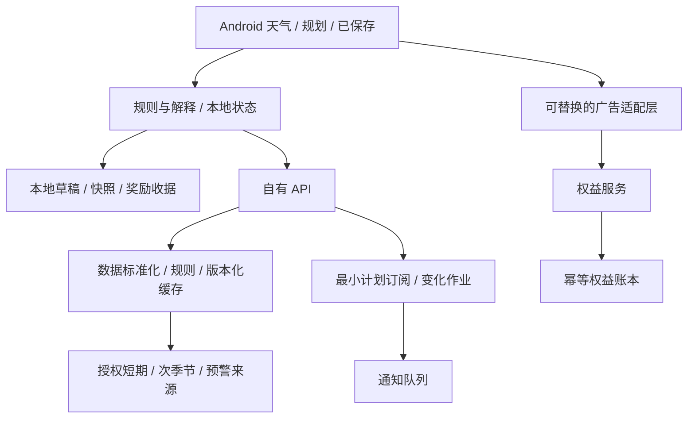

# 技术可行性、数据边界与交付架构

更新日期：2026-09-30。状态：架构提案；无应用工程、无生产服务。本文件帮助评估设计能否交付，不把 SDK 和后端细节放到普通用户流程。

2026-09-30 成本复评：用户要求优先免费商用来源及个人可承担的部署。新增 MET Norway、NWS 与 Open-Meteo 开源查询服务 / AWS 开放数据候选，见[专项研究](cost-and-free-alternatives-2026-09-30.md)及[小型实验](../experiments/free-sources.md)。这不要求自运行气象模型，也不引入 LLM；候选不等于已完成供应商选型。下面商业聚合接口保留为对照，不再是唯一候选路线。

用户进一步提出利用已有 NAS、云服务器和 Cloudflare，并提供大陆 NAS、32 GB 内存、2 TB SSD、约 5M 上行等信息。推荐试验分工为 NAS 后台取数/处理，云服务器保存可直接返回的结果，Cloudflare 只缓存明确公开的响应；硬件、带宽单位和限额的主要定义见[NAS 部署方案](nas-cloud-architecture-2026-09-30.md)。尚未实机测试，不替换本文件的领域、隐私与数据质量要求，也未执行部署。

## 1. 平台与最小架构

规划默认：Android 原生 Kotlin / Jetpack Compose，业务规则与 UI、数据源、广告适配层隔离。最低系统暂按 Android 9（API 28）做原型预算，尚未锁定；目标 SDK、依赖稳定版、Play 当期要求在工程初始化时核验，不在设计文档虚构版本号。iOS、Web 与账号同步延后。

首期采用一个可分模块的后端服务加定时工作进程，数据库与缓存按实测需要配置；不预设微服务、消息集群或全球 GRIB 管道。Docker 用于隔离数据适配与统计实验，Windows 可验证领域规则与服务，Android 体验必须用模拟器和真机。

## 2. 能力到数据的对应关系

| 能力 | 候选输入 | 接入前必须证明 | 缺失时的产品行为 |
| --- | --- | --- | --- |
| 首 7 天小时 / 最多 16 天日参考 | Open-Meteo 商业端点或同等授权聚合 API | 变量语义、原生步长、模型来源、计费权重、缓存许可、时间完整性 | 减少真实覆盖，显示实际日期，不能补造 |
| 多模型比较 | IFS / GFS / ICON 等真实独立模式 | 同口径字段与各自覆盖；不将混合结果重复计为模式 | 模型不足时显示未知 |
| 周趋势 | EC46 周统计，必要时依法获取成员与基准 | 授权、基准、原生周边界、目标地区质量；试验已发现末端空值 | 隐藏不可交付的周趋势奖励 |
| 官方预警 | 选定首发国家的权威发布源或具再展示授权的服务 | 区域、有效期、撤销/更新、署名和服务可用性 | “预警信息暂不可用”，保留权威入口 |
| 地点查询/地图 | 具有商业许可的地理编码与基础地图服务 | 地点时区、重名处理、配额、署名、缓存和 SDK 许可 | 列表模式可完整使用；已有地点离线可读 |
| 活动窗口/变化 | 标准化快照与版本化规则 | 解释可追溯、时间一致、独立观测验证 | 不输出推荐或改成原始参考 |

供应商尚未选定或采购，不把公共 OSM 瓦片或任意地理编码公共实例当免费生产 CDN。地图只渲染候选地点，不需要天气栅格接口。后续连续天气地图须重新验证数据版权、批量交付、CDN、耗电和收入。

许可核验矩阵必须覆盖：商业 App 再展示、广告变现、服务器缓存、历史快照/归档、衍生统计、截图分享、请求配额、署名、服务国家及终止后的数据处理。上游开放数据许可与托管 API 使用条件分别核验。

## 3. 领域对象与接口边界

| 对象 | 必需内容 |
| --- | --- |
| Place | 自有地点 ID、用户标签、本地时区、经纬度、行政区、网格映射与支持状态 |
| ForecastSnapshot | [预报方法](forecast-method.md)定义的全部来源与统计元数据、变量值、缺失/延迟标记、版本、内容哈希 |
| PlanRevision | 计划/修订 ID、地点集、活动时段、阈值、选中地点、保存的快照引用、创建时刻 |
| ComparisonResult | 各候选状态、理由代码、规则版本、比较口径、生成时刻；无结论也是有效结果 |
| RewardOffer / Grant | [广告设计](monetization.md)中的会话、承诺、状态、开始到期、发放原因、幂等键 |
| ChangeEvent | 同一修订的前后快照、可比较性、变化字段、触发理由、是否已通知 |
| CapabilityManifest | 按国家/地区/日期/变量的支持状态、是否通过质量门槛、当前故障、奖励可包含功能 |

建议 API 分为 `places/search`、`forecast`、`capabilities`、`plans/compare`、`plans/revisions`、`rewards/offers`、`rewards/status`、`privacy/delete`。它们只是接口职责，不是已经可调用的 URL。天气服务不依赖广告服务成功；广告故障不能拖垮免费天气。

`plans/compare` 使用请求幂等键防止重试重复扣额度；读写校验当前安装与计划归属。生产密钥只在服务端，客户端不保存供应商密钥。服务端控制范围与限速，不相信客户端的奖励到期时刻。

未启用提醒的比较与保存以本机为主：后端仅在请求处理期间使用地点和条件，不持久化用户行程。启用提醒后才建立最小云端计划记录；共享气象网格缓存与用户计划存储分开，不通过缓存反向建立用户访问轨迹。

## 4. 缓存、成本与刷新

缓存优先按上游网格、模型、起报周期、变量集、有效区间与统计版本复用，而不是每次开 App 都拉全量集合。网格化不能掩盖山地/海岸局地差异；保留请求地点和实际网格的距离、高度差（若有）。

前台先展示已有快照，再验证新鲜度。上游未产生新起报周期时重复打开不重复计算变化。计划后台只跟踪选中地点；其他候选保留静态快照，活跃权益下用户主动刷新再更新完整比较。

计划普通后台刷新默认每 6 小时检查一次新数据；距活动开始 48 小时内每 3 小时检查一次。仅在源有新周期、数据授权允许时获取；休眠设备上的通知不承诺分钟级。预警的抓取周期按所选权威源和时效要求另行验证，不套用普通计划频率。

所有缓存返回原始更新时间、状态及可能缺失字段。网络失败采用有上限的退避与请求合并；不要让用户不断点击触发并发上游调用。数据源更换先做影子比较，版本切换不能悄悄改掉用户基线。

## 5. 隐私与保留设计

不用账户不等于无数据收集。基础天气需要向服务端传递所选地点，广告 SDK 也可能处理网络、设备和广告相关信息；隐私说明按实际集成声明，不宣传“零追踪”来掩盖第三方处理。

| 数据 | 默认位置与保留 | 控制与限制 |
| --- | --- | --- |
| 搜索、收藏、未保存草稿 | 本机；用户可清空 | 服务端请求日志不记录原始搜索词、完整坐标和用户自定义名称 |
| 预报缓存 | 服务端按数据产品许可保留 | 无用户标识的公共模型网格可复用；精确查询轨迹不形成用户画像 |
| 已保存计划与快照 | 本机至用户删除；云端仅在启用提醒后保存必要字段 | 首次启用解释上传内容；计划结束 30 天后删除云端用户关联记录，用户可提前删除 |
| 推送 token | 仅提醒开启时上传 | 关闭提醒或删除安装数据时解除订阅；失效 token 清理 |
| 广告会话/权益记录 | 后端随机安装引用，已结清记录默认保留 90 天；未兑现补偿保留最小收据至解决或用户删除 | 不包含地点、活动内容和个人姓名；用于恢复与幂等，期限待政策审查 |
| 质量事件与诊断 | 最小字段，默认保留 30 天，之后聚合 | 研究参与另行明确同意；不上传行程坐标或自由文本 |

开启系统定位只请求前台使用，手动搜索可替代；不为天气申请后台位置或联系人。通知与定位、广告同意彼此独立。分享前给用户预览，默认不附精确住所坐标。

按地区接入适用的同意与隐私选项流程；广告请求必须受所选 SDK 的同意状态控制。拒绝个性化不简单等于所有非个性化请求都已获授权；具体使用 UMP/CMP 的适用配置在上线国家明确后核验。设计参考入口：[Google Android 隐私文档](https://developers.google.com/admob/android/privacy)。本轮直读该页面受限，未把它当作已完整核验的法律结论。

本轮不完成全球法律审查。正式发布前根据实际国家、广告 SDK、年龄定位和运营实体核对必要义务；“不服务大陆”不能直接推出所有海外市场规则一致。这里的保留期限都是提案，不冒充法定期限。

## 6. 服务可靠性与安全边界

核心异常：数据源超时、部分模型缺值、起报未知、周区间错位、广告发奖乱序、权益服务不可达、跨设备/重装、通知拒绝和地图失败。各层有明确可恢复错误码，客户端显示用户可理解的下一步。

禁止把批量坐标查询开放为无额度代理；按安装、会话与服务端成本限流。成本限流显示真实原因，不引导用户用广告无限增加供应商调用。日志不写密钥，SSV 不能靠查询参数存在就判真。

数据与权益策略可远程关闭故障入口，但配置必须签名/验证、版本化，并保留现存权益及快照。关闭周趋势不导致首页不可用。紧急更新政策不能追溯缩短已经获奖的有效期。

## 7. 实现前必须完成的技术小实验

1. 对英国候选样本验证同口径小时字段、原生步长、起报元数据与多模型覆盖；不足则调源或调整推荐表达。
2. 验证目标周统计的日期、基准、空值与商业端点；沿用既有 Docker 实验，不把历史北京样本计作目标市场证明。
3. 用官方测试广告验证完成、取消、杀进程、SSV 乱序和离线恢复；尚不接入真实广告收入。
4. 测量一个计划与一个活跃用户的供应商计费单位、缓存字节、后台刷新与分享成本。
5. 只在以上可行后建立 Android 原型和真实页面性能测量。必要测试与通过标准见[验证计划](validation.md)。
